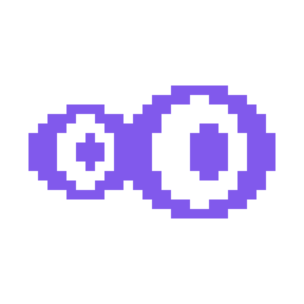

# Eichi

**A educação deve ser para todos**

*Sistema web completo de plataforma de estudos*

---

> [!WARNING] 
Este arquivo está em construção e poderá sofrer alterações constantes até que o projeto esteja minimamente finalizado.
